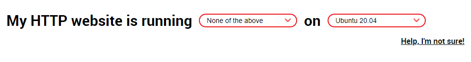

Deploying a secure, simple web application in production with Let's Encrypt & Certbot


[Let's Encrypt](https://letsencrypt.org/) is a free, automated, and open certificate authority brought to you by the nonprofit [Internet Security Research Group (ISRG)](https://www.abetterinternet.org/). [Certbot](https://certbot.eff.org/) is a free, open source software tool for automatically using Let’s Encrypt certificates on manually-administrated websites to enable HTTPS. [Certbot](https://certbot.eff.org/) is made by the Electronic Frontier Foundation (EFF), a 501(c)3 nonprofit based in San Francisco, CA, that defends digital privacy, free speech, and innovation


```terminal
  ▄▄██                                                                                         ██▄▄
  ░▄▄▓██████▌                                                                           ▐██████▓▄▄░
  ▀██▓░▀███       ▄▄▄▄   ▄▄▄▄▄█░                                     ░█▄▄▄▄▄   ▄▄▄▄       ███▀░▓██▀
  ░    ▀██▄ ▀█▓  ▄▄███████▄  ▀▓▀ ▓█▄                             ▄█▓ ▀▓▀  ▄███████▄▄  ▓█▀ ▄██▀    ░
  █▄▄  ▀█▓ ▀██▀▀░    ▀▀▓█▒ ░▄▄▄▓███ ░                           ░ ███▓▄▄▄░ ▒█▓▀▀    ░▀▀██▀ ▓█▀  ▄▄█
  ▒███▓▄▄ ▀█▄            ▀███▓▀▀▀░                                 ░▀▀▀▓███▀            ▄█▀ ▄▄▓███▒
  ▓███▀▀▓█▄███▄            ▀                                             ▀            ▄███▄█▓▀▀███▓
  ██▓██▄▄ ▀▀▓▓                                                                         ▓▓▀▀ ▄▄██▓██
  ░▀▀▀███▄                                                                                 ▄███▀▀▀░
  ██████▄██▓                          .░::  W E L C O M E ::░.                           ▓██▄██████
  ▓██                                                                                           ██▓
  ░█▓     While the examples here are largely Node based, the concepts are applicable to any    ██░
  ██      application based web server where you want to securely deploy any application or      ██
  █▓      service with HTTPS using Let's Encrypt and Certbot                                     ▓█
  █▓                                                                                             ▓█
  █▓                                                                                             ▓█
  █▓                                                                                             ▓█
  ▐███▓▄▄▄▄        ▄▌                                                           ▐▄        ▄▄▄▄▓███▌
  ▀   ▄██▓  ░▄▄▄▄▄██ ██░   ▄▄█                                         █▄▄   ░██ ██▄▄▄▄▄░  ▓██▄   ▀
  ▄█████▓██▓▀▀▀██▌▐███▄  ▐▓▓█▄░▄█▄                                 ▄█▄░▄█▓▓▌  ▄███▌▐██▀▀▀▓██▓█████▄
  ▄█▓▀▀▀▀▀      ▓██ ██▓▐█▓ ██  ▀█▀  ▀■                         ■▀  ▀█▀  ██ ▓█▌▓██ ██▓      ▀▀▀▀▀▓█▄
          ███▓███  ▀████▌                                                   ▐████▀  ███▓███
         ░▀    ▀▌    █▀                                                       ▀█    ▐▀    ▀░
```


```terminal

 ██████╗  ██████╗  █████╗ ██╗     ███████╗
██╔════╝ ██╔═══██╗██╔══██╗██║     ██╔════╝
██║  ███╗██║   ██║███████║██║     ███████╗
██║   ██║██║   ██║██╔══██║██║     ╚════██║
╚██████╔╝╚██████╔╝██║  ██║███████╗███████║
 ╚═════╝  ╚═════╝ ╚═╝  ╚═╝╚══════╝╚══════╝
```
## WHAT DO WE WANT?

*   It should be easy to setup
*   It should be easy to maintain
*   It should be least privilege
*   It should not compromise security of the app or the operating system


**What we know:**

| Node App                                                                             | Let's Encrypt                                                                                                  |
|--------------------------------------------------------------------------------------|----------------------------------------------------------------------------------------------------------------|
| Usually run in the context of the login user                                         | Run as sudo to register, setup, and renew                                                                      |
| Login user usually has sudoers access                                                | Saves certificates as root:root with permissions of 700                                                        |
| SHOULD **NOT** BE RUN AS ROOT                                                        | Saves files to /etc/letsencrypt/archive/ and symlinks /etc/letsencrypt/live/ back to /etc/letsencrypt/archive/ |
| May have to access assets on the file system with different users/groups/permissions | Documentation recommends creating a publicly accessible key file for validation                                |
| Usually runs on some port other than 80                                              | Certificates expire every 90 days                                                                              |


```terminal

████████╗██╗  ██╗███████╗    ██████╗ ██████╗  ██████╗ ██████╗ ██╗     ███████╗███╗   ███╗
╚══██╔══╝██║  ██║██╔════╝    ██╔══██╗██╔══██╗██╔═══██╗██╔══██╗██║     ██╔════╝████╗ ████║
   ██║   ███████║█████╗      ██████╔╝██████╔╝██║   ██║██████╔╝██║     █████╗  ██╔████╔██║
   ██║   ██╔══██║██╔══╝      ██╔═══╝ ██╔══██╗██║   ██║██╔══██╗██║     ██╔══╝  ██║╚██╔╝██║
   ██║   ██║  ██║███████╗    ██║     ██║  ██║╚██████╔╝██████╔╝███████╗███████╗██║ ╚═╝ ██║
   ╚═╝   ╚═╝  ╚═╝╚══════╝    ╚═╝     ╚═╝  ╚═╝ ╚═════╝ ╚═════╝ ╚══════╝╚══════╝╚═╝     ╚═╝
```

## WHAT DO WE HAVE TO SOLVE

Node running as a non root user trying to access the Let's Encrypt certificate files that are only available to the root user causing an `EACCES: permission denied` error like:
```javascript
Error: EACCES: permission denied, open '/etc/letsencrypt/live/some_domain_name/privcert.pem'
    at Object.openSync (fs.js:438:3)
    at Object.readFileSync (fs.js:343:35)
    at Object.<anonymous> (/some_path/server.js:26:12)
    at Module._compile (internal/modules/cjs/loader.js:701:30)
    at Object.Module._extensions..js (internal/modules/cjs/loader.js:712:10)
    at Module.load (internal/modules/cjs/loader.js:600:32)
    at tryModuleLoad (internal/modules/cjs/loader.js:539:12)
    at Function.Module._load (internal/modules/cjs/loader.js:531:3)
    at Function.Module.runMain (internal/modules/cjs/loader.js:754:12)
    at startup (internal/bootstrap/node.js:283:19)
```


```terminal

███████╗ ██████╗ ██╗     ██╗   ██╗████████╗██╗ ██████╗ ███╗   ██╗███████╗██████╗
██╔════╝██╔═══██╗██║     ██║   ██║╚══██╔══╝██║██╔═══██╗████╗  ██║██╔════╝╚════██╗
███████╗██║   ██║██║     ██║   ██║   ██║   ██║██║   ██║██╔██╗ ██║███████╗  ▄███╔╝
╚════██║██║   ██║██║     ██║   ██║   ██║   ██║██║   ██║██║╚██╗██║╚════██║  ▀▀══╝
███████║╚██████╔╝███████╗╚██████╔╝   ██║   ██║╚██████╔╝██║ ╚████║███████║  ██╗   
╚══════╝ ╚═════╝ ╚══════╝ ╚═════╝    ╚═╝   ╚═╝ ╚═════╝ ╚═╝  ╚═══╝╚══════╝  ╚═╝   
```

## SOME OPTIONS


1.  changing public key, private key, and certificate authority file permissions
1.  moving public key, private key, and certificate authority files directly into the node application directory
1.  spin up another web server like Apache or NGi&Icy;X for reverse proxying traffic
1.  using Docker for reverse proxying traffic

There are some creative, disturbing, wrong, or relatively complicated advice on Stack Overflow to get this setup to work.
Some of the potential solutions above are perfectly valid ways to go about achieving the goal of deploying a Node app with Let's Encrypt but adds a level of complexity that **may be** overkill for the task at hand. We want a simple server to run a website or service, We don't want to be fighting with a lot infrastructure.


### Potential Solution 1: Changing pubkey.pem, privkey.pem, and ca.pem file permissions

e.g. `chmod 755 /etc/letsencrypt/live/some_domain_name/*.pem`

**Pros**
*   It works

**Cons**
*   It's inherently less secure than other options *(read and execute permission for non root users on the file)*
*   It messes with the default, secure permissions set up by CertBot for the files and directory structure
*   It can potentially interfere with the CertBot script functionality (now or in the future) if there are permissions checks in place
*   Any user on the system can now access the files

> Private keys usually have the permissions of 600 (owner: read+write), Certificates permissions of 700 (owner: read+write+execute) for a reason. They should only be accessible to the user and not anyone else, the same logic applies with the Let's Encrypt files. We want to keep the private stuff private and secure.
>
> *   :heavy_check_mark: It should be easy to setup
> *   :heavy_check_mark: It should be easy to maintain
> *   :x: It should be least privilege
> *   :x: It should not compromise security of the app or the operating system

---

### Potential Solution 2: Moving pubkey.pem, privkey.pem, and ca.pem files directly into the node application directory

e.g. `cp /etc/letsencrypt/archive/some_domain_name/* some_path/ && chmod 755 some_path/*.pem`

**Pros**
*   It works

**Cons**
*   It's inherently less secure than other options
*   This is the equivalent to moving the combination closer to the safe. If your application code, a dependency you rely on, or the web server itself are compromised your keys potentially could be as well
*   It introduces another step in a process that should be automated. You may need to manually move the files after the updates, write a script to do so, update the synlinks, etc.
*   It messes with the default secure permissions set up by CertBot for the files and directory structure
*   It can potentially interfere with the CertBot script functionality (now or in the future) it there are permissions checks in place
*   Any user on the system can now access the files

> We want to take advantage of what CertBot does and then leave it be. We do not want to introduce any fragility to the process where a script could fail, a symlink disappears etc.
>
> *   :heavy_check_mark: It should be easy to setup
> *   :warning: It should be easy to maintain
> *   :x: It should be least privilege
> *   :x: It should not compromise security of the app or the operating system

---

### Potential Solution 3: Spin up an Apache or NGi&Icy;X and reverse proxy requests to the back end Node app server

**Pros**
*   It works
*   It scales if you have multiple apps and/or services
*   It can be more secure (if Apache or NGi&Icy;X are configured correctly)
*   Apache and NGi&Icy;X run in different contexts (users) than Node
*   TLS (HTTPS) termination at this level can reduce the number certificates for individual apps/services

**Cons**
*   This could be overkill for the task at hand
*   It's an added layer that can make things harder to diagnose, debug, and maintain
*   It requires knowledge of Apache or NGi&Icy;X configuration which can a high bar for entry


> This is an attractive option, albeit an advanced one, if you need to maintain multiple Node apps and/or services or maintain different apps and/or services written in different languages. One possibility is that Apache or NGi&Icy;X can act as a load balancer and handle the HTTPS termination in one place rather than each app and/or service doing so individually
>
> *   :x: It should be easy to setup
> *   :warning: It should be easy to maintain
> *   :heavy_check_mark: It should be least privilege
> *   :heavy_check_mark: It should not compromise security of the app or the operating system

---

### Potential Solution 4: Spin up a Docker container and proxy requests to the Node app

**Pros**
*   It works
*   It scales (up to a point) if you have multiple apps and/or services
*   It can be more secure (if the orchestration platform e.g. Docker Server, Kubernetes and the container are configured correctly)
*   Docker runs in different contexts (users) than Node

**Cons**
*   This could be overkill for the task at hand
*   It requires existing infrastructure to be in place and secured (e.g. Kubernetes, EKS, GKS, Rancher) Docker in Productions is very different than Docker locally
*   Some official Docker images are outdated and insecure
*   It's an added layer that can make things harder to diagnose, debug, and maintain
*   It requires some knowledge of Docker configuration which may be a high bar for entry
*   `docker run container_name` is inherently more insecure then other options [unless limits are added]([https://github.com/docker/docker-bench-security)

> This is an attractive option, albeit an advanced one, if you need to maintain multiple Node apps and/or services or maintain different apps and/or services written in different languages. If you already have infrastructure in place to support this option, great. If not, then getting something up quickly, securely and cheaply might be an issue. It's important to know that some official Node images can be [**very insecure**](https://github.com/aquasecurity/trivy). There are many secure options available depending on your needs.
>
>*   :x: It should be easy to setup
>*   :x: It should be easy to maintain
>*   :warning: It should be least privilege
>*   :warning: It should not compromise security of the app or the operating system

---

```terminal

 █████╗     ██████╗ ███████╗████████╗████████╗███████╗██████╗     ██╗    ██╗ █████╗ ██╗   ██╗
██╔══██╗    ██╔══██╗██╔════╝╚══██╔══╝╚══██╔══╝██╔════╝██╔══██╗    ██║    ██║██╔══██╗╚██╗ ██╔╝
███████║    ██████╔╝█████╗     ██║      ██║   █████╗  ██████╔╝    ██║ █╗ ██║███████║ ╚████╔╝
██╔══██║    ██╔══██╗██╔══╝     ██║      ██║   ██╔══╝  ██╔══██╗    ██║███╗██║██╔══██║  ╚██╔╝  
██║  ██║    ██████╔╝███████╗   ██║      ██║   ███████╗██║  ██║    ╚███╔███╔╝██║  ██║   ██║   
╚═╝  ╚═╝    ╚═════╝ ╚══════╝   ╚═╝      ╚═╝   ╚══════╝╚═╝  ╚═╝     ╚══╝╚══╝ ╚═╝  ╚═╝   ╚═╝   

```

## PREREQUISITES

*   You must have a valid domain and that domain must be available via DNS. Lets Encrypt Certificates do not support IP Addresses

*   Your domain needs to be pointing to a VM, Container, or Load Balancer etc. and that VM, Container, or Load Balancer must be reachable on the INTERNET

*   Your VM, Container, or Load Balancer must have SSH access

*   The user must have sudoer access


```terminal

██╗     ███████╗████████╗███████╗     ██████╗  ██████╗ ██╗
██║     ██╔════╝╚══██╔══╝██╔════╝    ██╔════╝ ██╔═══██╗██║
██║     █████╗     ██║   ███████╗    ██║  ███╗██║   ██║██║
██║     ██╔══╝     ██║   ╚════██║    ██║   ██║██║   ██║╚═╝
███████╗███████╗   ██║   ███████║    ╚██████╔╝╚██████╔╝██╗
╚══════╝╚══════╝   ╚═╝   ╚══════╝     ╚═════╝  ╚═════╝ ╚═╝

```

## A PATH TO SUCCESS

1.  Install CertBot by opening [https://certbot.eff.org/lets-encrypt/sharedhost-other](https://certbot.eff.org/lets-encrypt/sharedhost-other)  in a new tab. Select My HTTP website is running **None of the above** on **\<YOUR_OPERATING_SYSTEM>**

    

1.  Follow the instructions for installing Certbot for your OS. Once you have installed proceed to the next step

1.  If this is your first time running Certbot. Register your account by replacing `<MY_EMAIL_ADDRESS@MAIL.COM>` below with your real email address

    ```bash
    sudo certbot register --agree-tos -m <MY_EMAIL_ADDRESS@MAIL.COM>
    ```
    Successful output will look like:

    ```terminal
    Saving debug log to /var/log/letsencrypt/letsencrypt.log

    - - - - - - - - - - - - - - - - - - - - - - - - - - - - - - - - - - - - - - - -
    Would you be willing, once your first certificate is successfully issued, to
    share your email address with the Electronic Frontier Foundation, a founding
    partner of the Let's Encrypt project and the non-profit organization that
    develops Certbot? We'd like to send you email about our work encrypting the web,
    EFF news, campaigns, and ways to support digital freedom.
    - - - - - - - - - - - - - - - - - - - - - - - - - - - - - - - - - - - - - - - -
    (Y)es/(N)o: Y
    Account registered.

    ```

    > Accepting the offer for the EFF to have your email is  up to you.

1.  It is likely that your application server is running on some port other than 80. Before we attempt installing the certificates, your app or service needs to be available on the Web. To do this, we will add a temporary IP table rule to route traffic from port 80 => to whatever port your app is running on

    ```bash
    sudo iptables --table nat --append PREROUTING --in-interface <YOUR_NETWORK_INTERFACE> --protocol tcp --dport 80 --jump REDIRECT --to-port <YOUR_APPLICATION_PORT>
    ```

    e.g.

    ```bash
    sudo iptables --table nat --append PREROUTING --in-interface eth0 --protocol tcp --dport 80 --jump REDIRECT --to-port 3000

    ```
    > By default many network interfaces are "eth0". If you don't know or want to confirm type `ip addr` or `ifconfig` into your terminal

    The iptables rules are temporary and will go away on a VM reboot (we'll address this later). This rule states

    1.  Redirect any traffic coming across the eth0 network interface on port 80 and redirect that traffic to port 3000

1.  Optional: Check to see if the rule is there

     ```bash
     sudo iptables --list --table nat
     ```

1.  Your **production version** Node app needs to be running (**Without HTTPS**) while we install the certificates with Certbot. Start your Node app

    ```bash
    npm run <MY_APP_NAME>
    ```

1.  Next we are going to install the certificates. `webroot-path` needs to be a **publicly available** folder in your app directory structure after your build process. Certbot requires this for installation and validation, but will not store the certificate files in this folder.

    ```bash
    sudo certbot certonly -d <MY_DOMAIN_NAME> --webroot --webroot-path <ABSOLUTE_PATH_TO>/<MY_APP_NAME>/public
    ```

    e.g.

    ```bash
    sudo certbot certonly -d mydomain.com --webroot --webroot-path /home/ubuntu/my_web_app/public
    ```

    Successful output will look like

    ```terminal
    Saving debug log to /var/log/letsencrypt/letsencrypt.log
    Requesting a certificate for mydomain.com

    Successfully received certificate.
    Certificate is saved at: /etc/letsencrypt/live/mydomain.com/fullchain.pem
    Key is saved at:         /etc/letsencrypt/live/mydomain.com/privkey.pem
    This certificate expires on 2021-11-05.
    These files will be updated when the certificate renews.
    Certbot has set up a scheduled task to automatically renew this certificate in the background.

    - - - - - - - - - - - - - - - - - - - - - - - - - - - - - - - - - - - - - - - -
    If you like Certbot, please consider supporting our work by:
     * Donating to ISRG / Let's Encrypt:   https://letsencrypt.org/donate
     * Donating to EFF:                    https://eff.org/donate-le
    - - - - - - - - - - - - - - - - - - - - - - - - - - - - - - - - - - - - - - - -
    ```

    > Doing it this way prevents having to manually add a file with the validation key to the public folder

1.  Next, stop your Node app and update the HTTPS/TLS configuration paths in your app e.g.

    ```javascript
    const tls_svr = http2.createSecureServer({
        ca: fs.readFileSync('/etc/letsencrypt/live/<MY_DOMAIN_NAME>/ca.pem'),
        cert: fs.readFileSync('/etc/letsencrypt/live/<MY_DOMAIN_NAME>/cert.pem'),
        key: fs.readFileSync('/etc/letsencrypt/live/<MY_DOMAIN_NAME>/privkey.pem'),
    });
    ```
    > As these paths SHOULD NOT change. You can commit these paths in your Environment configuration files, AWS Secrets Manager etc.

1.  Now that we have gotten our certificates installed, lets correct our iptables rules to reflect the right configuration To do this, we need to delete our old rule and add an IP table rule to route traffic from port 80 => 443 and then port 443 to whatever port your app is running on

    DELETE:

    ```bash
    sudo iptables -t nat -D PREROUTING -i  <YOUR_NETWORK_INTERFACE> -p tcp --dport 443 -j REDIRECT --to-port <YOUR_APPLICATION_PORT>
    ```

    ADD:

    ```bash
    sudo iptables -t nat -A PREROUTING -i <YOUR_NETWORK_INTERFACE> -p tcp --dport 80 -j REDIRECT --to-port 443
    sudo iptables -t nat -A PREROUTING -i  <YOUR_NETWORK_INTERFACE> -p tcp --dport 443 -j REDIRECT --to-port <YOUR_APPLICATION_PORT>
    ```

    e.g.

    ```bash
    sudo iptables -t nat -D PREROUTING -i eth0 -p tcp --dport 80 -j REDIRECT --to-port 3000
    ```

    ```bash
    sudo iptables -t nat -A PREROUTING -i eth0 -p tcp --dport 80 -j REDIRECT --to-port 443
    sudo iptables -t nat -A PREROUTING -i eth0 -p tcp --dport 443 -j REDIRECT --to-port 3000
    ```

    By default many network interfaces are `eth0`, however, this depends on your Operating System. If you don't know, or want to confirm type `ip addr` (Newer \*Nix Distros) or `ifconfig` (Older \*Nix Distros) into your terminal. In the example output below, the interface is `ens33`

    ```bash
      user@ubuntu: ip addr
      1: lo: <LOOPBACK,UP,LOWER_UP> mtu 65536 qdisc noqueue state UNKNOWN group default qlen 1000
      link/loopback 00:00:00:00:00:00 brd 00:00:00:00:00:00
      inet 127.0.0.1/8 scope host lo
         valid_lft forever preferred_lft forever
      inet6 ::1/128 scope host
         valid_lft forever preferred_lft forever
      2: ens33: <BROADCAST,MULTICAST,UP,LOWER_UP> mtu 1500 qdisc pfifo_fast state UP group default qlen 1000
          link/ether 00:0c:29:a4:f1:4a brd ff:ff:ff:ff:ff:ff
          inet 192.168.0.1/24 brd 192.168.0.255 scope global dynamic ens33
             valid_lft 1138sec preferred_lft 1138sec
          inet6 fe80::f53e:89e:b44a:c634/64 scope link
             valid_lft forever preferred_lft forever
      3: docker0: <NO-CARRIER,BROADCAST,MULTICAST,UP> mtu 1500 qdisc noqueue state DOWN group default
          link/ether 02:42:bc:d3:df:97 brd ff:ff:ff:ff:ff:ff
          inet 172.17.0.1/16 brd 172.17.255.255 scope global docker0
             valid_lft forever preferred_lft forever
    ```

    The iptables rules are temporary and will go away on a VM reboot. The rules above state

    1.  Redirect any traffic coming across the eth0 network interface on port 80 and redirect that traffic to port 443

    1.  Redirect any traffic coming across the eth0 network interface on port 443 and redirect that traffic to port 3000

    **[Make these iptables rules permanent](iptables.md)**

1.  To secure our VM and application further, we're going to create a new `non-root`, `non-admin` user to handle just the application stuff and only the application stuff

    ```bash
    sudo useradd -m node-user
    ```

1.  Give the new non-root, non-admin node-user a password

    ```bash
    sudo passwd node-user
    ```

1.  We're going to limit who has access to our new certificate files by creating a FACL (File Access Control List). By doing so we only allow the Root user and our new node-user access to the files without exposing them to everyone else.

    ```bash
    setfacl --recursive --map "u:user:permissions" <file/dir>
    ```

    e.g.

    ```bash
    setfacl --recursive --mask u:node-user:rX /etc/letsencrypt/{live,archive}/<MY_DOMAIN_NAME>/
    ```
    > This FACL states recursively (--recursive) set access for node-user with Read+Execute permissions (--mask "u:user:permissions") on all letsencrypt directories (/etc/letsencrypt/{live,archive}) for mydomain

1.  login as the new node-user, enter the password when prompted

    ```bash
    sudo - node-user
    ```

1.  rerun your application build script

    ```bash
    npm run <MY_APP_NAME>
    ```

1.  logout of the node-user

    ```bash
    exit
    ```

```terminal

 ██████╗ ██████╗ ███╗   ██╗ ██████╗██╗     ██╗   ██╗███████╗██╗ ██████╗ ███╗   ██╗
██╔════╝██╔═══██╗████╗  ██║██╔════╝██║     ██║   ██║██╔════╝██║██╔═══██╗████╗  ██║
██║     ██║   ██║██╔██╗ ██║██║     ██║     ██║   ██║███████╗██║██║   ██║██╔██╗ ██║
██║     ██║   ██║██║╚██╗██║██║     ██║     ██║   ██║╚════██║██║██║   ██║██║╚██╗██║
╚██████╗╚██████╔╝██║ ╚████║╚██████╗███████╗╚██████╔╝███████║██║╚██████╔╝██║ ╚████║
 ╚═════╝ ╚═════╝ ╚═╝  ╚═══╝ ╚═════╝╚══════╝ ╚═════╝ ╚══════╝╚═╝ ╚═════╝ ╚═╝  ╚═══╝

```

<a name="conclusion"></a>

If everything went as planned, you should now have a web application running with HTTPS enabled and will automatically renew every 90 days with the help of Certbot's auto-renewal script. If things didn't go smoothly, checkout the [Common Issues](common_issues.md) file
